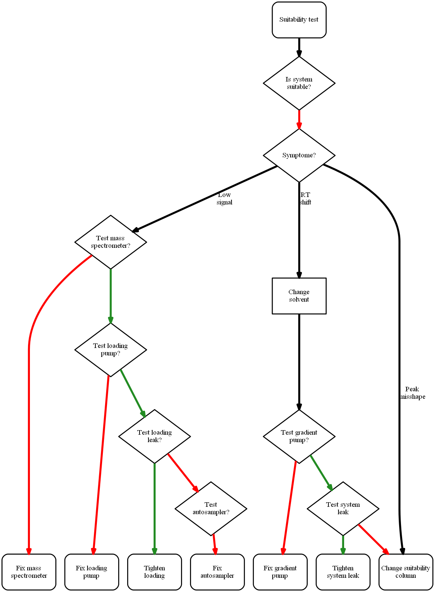

# algograph

[](https://travis-ci.org/genadijrazdorov/algograph)
[](https://codecov.io/gh/genadijrazdorov/algograph)
[](https://github.com/genadijrazdorov/algograph/blob/master/LICENSE)

Algorithm to graph translator.

## Usage example

Here is the LC/MS troubleshooting algorithm:

```python
# algo.py

if not system_suitable:
    if symptom is low_signal:
	if not test(mass_spectrometer):
	    fix(mass_spectrometer)
	    return

	elif not test(loading_pump):
	    fix(loading_pump)
	    return

	elif test(loading_leak):
	    tighten(loading)
	    return

	elif not test(autosampler):
	    fix(autosampler)
	    return

    elif symptom is rt_shift:
	change(solvent)

	if not test(gradient_pump):
	    fix(gradient_pump)
	    return

	elif test(system_leak):
	    tighten(system_leak)
	    return

	else:
	    change(suitability_column)
	    return

    elif symptom is peak_misshape:
	if peak_widening:
	    pass

	elif peak_tailing:
	    pass

	elif peak_fronting:
	    pass

```

... which is easily translated to flowchart:

```bash
$ algograph algo.py | dot -Tpng -oflowchart.png

```

... looking something like this:




## Help

For the console script usage try:

```
$ algograph --help
```
